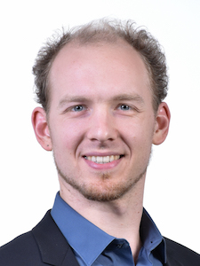

I am PhD student in the Code Recommenders subgroup of the <a href="http://www.stg.tu-darmstadt.de/" target="STG">Software Technology Group</a> at TU Darmstadt.

  * 2013–now, TU Darmstadt, PhD student, advised by Mira Mezini
  * 2012, Pontifical Catholic University of Rio de Janeiro, exchange student
  * 2009–2013, TU Darmstadt, master&#8217;s degree
  * 2006–2009, TU Darmstadt, bachelor&#8217;s degree

I lead <a href="http://sven-amann.de/eko/" target="_blank">the Eko Software Campus project</a>, in which we build developer-assistance tools to help avoiding incorrect usage of third-party APIs. I&#8217;m also a core contributor to <a href="http://kave.cc" target="_blank">the KaVE Software Campus project</a>, in which we build developer-assistance tools to help learning and writing code towards third-party APIs quickly and correctly. The<a href="https://github.com/stg-tud/kave" target="_blank"> shared codebase</a> of both projects includes implementations of several data-mining and machine-learning algorithms that we use to collect and train usage models of APIs.

My general research interests include: developer-assistance tools, bug detection, mining software repositories, developer behavior, software testing, and static analysis.

I am a teacher and student of Software Engineering topics in general. My activities include <a href="http://www.stg.tu-darmstadt.de/staff/sven_amann/" target="_blank">university-level courses</a>, <a href="http://letsdeveloper.com/2015/03/1st-darmstadter-legacy-code-retreat/" target="_blank">Code Retreats</a>, <a href="http://youtube.com/letsdeveloper" target="_blank">the Let&#8217;s Developer YouTube Channel</a> and individual consultancy.